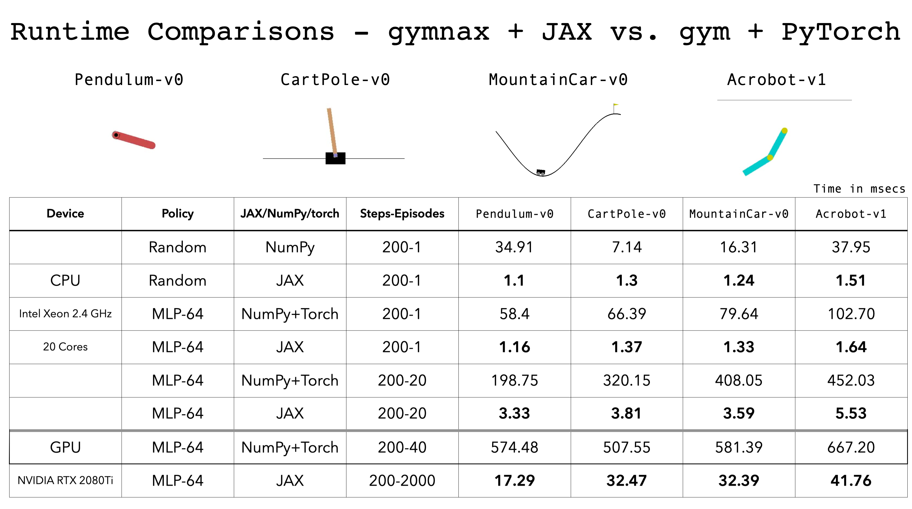

<h1 align="center">
  <a href="https://github.com/RobertTLange/gymnax/blob/main/docs/logo.png">
    </a><br>
  <b>Classic Gym Environments in JAX 🌍</b><br>
</h1>

<p align="center">
      <a href="https://pypi.python.org/pypi/gymnax">
        </a>
       <a href= "https://badge.fury.io/py/gymnax">
        </a>
       <a href= "https://github.com/RobertTLange/gymnax/blob/master/LICENSE.md">
        </a>
       <a href= "https://codecov.io/gh/RobertTLange/gymnax">
        </a>
       <a href= "https://colab.research.google.com/github/RobertTLange/gymnax/blob/main/examples/getting_started.ipynb">
        </a>
</p>


Are you fed up with slow CPU-based RL environment processes? Do you want to leverage massive vectorization for high-throughput RL experiments? `gymnax` brings the power of `jit` and `vmap`/`pmap` to the classic gym API. It support a range of different environments including [classic control](https://github.com/openai/gym/tree/master/gym/envs/classic_control), [bsuite](https://github.com/deepmind/bsuite), [MinAtar](https://github.com/kenjyoung/MinAtar/) and a collection of classic RL tasks. `gymnax` allows explicit functional control of environment settings (random seed or hyperparameters), which enables parallelized rollouts for different configurations (e.g. for meta RL). Finally, we provide training pipelines and checkpoints for both PPO and ES in the [`gymnax-blines`](https://github.com/RobertTLange/gymnax-blines) repository. Get started here 👉 [](https://colab.research.google.com/github/RobertTLange/gymnax/blob/main/examples/00_getting_started.ipynb).

## Basic `gymnax` API Usage 🍲

```python
import jax
import gymnax

rng = jax.random.PRNGKey(0)
rng, key_reset, key_act, key_step = jax.random.split(rng, 4)

env, env_params = gymnax.make("Pendulum-v1")

obs, state = env.reset(key_reset, env_params)
action = env.action_space(env_params).sample(key_act)
n_obs, n_state, reward, done, _ = env.step(key_step, state, action, env_params)
```

## Implemented Accelerated Environments 🏎️


| Environment Name | Reference | Source | `np` Speed Up | 🤖 ckpt (Return) |
| --- | --- | --- | --- | --- |
| [`Pendulum-v1`](https://github.com/RobertTLange/gymnax/blob/main/gymnax/environments/classic_control/pendulum.py) | [Brockman et al. (2016)](https://arxiv.org/abs/1606.01540)  | [Click](https://github.com/openai/gym/blob/master/gym/envs/classic_control/pendulum.py) | ~`?`x | [PPO](https://github.com/RobertTLange/gymnax-blines/agents/gym_pendulum/ppo), [ES](https://github.com/RobertTLange/gymnax-blines/agents/gym_pendulum/es) (R: -100)
| [`CartPole-v1`](https://github.com/RobertTLange/gymnax/blob/main/gymnax/environments/classic_control/cartpole.py) | [Brockman et al. (2016)](https://arxiv.org/abs/1606.01540)  | [Click](https://github.com/openai/gym/blob/master/gym/envs/classic_control/cartpole.py) | ~`?`x | [PPO](https://github.com/RobertTLange/gymnax-blines/agents/gym_pendulum/ppo), [ES](https://github.com/RobertTLange/gymnax-blines/agents/gym_pendulum/es) (R: -100)
| [`MountainCar-v0`](https://github.com/RobertTLange/gymnax/blob/main/gymnax/environments/classic_control/mountain_car.py) | [Brockman et al. (2016)](https://arxiv.org/abs/1606.01540) | [Click](https://github.com/openai/gym/blob/master/gym/envs/classic_control/mountain_car.py) | ~`?`x | [PPO](https://github.com/RobertTLange/gymnax-blines/agents/gym_pendulum/ppo), [ES](https://github.com/RobertTLange/gymnax-blines/agents/gym_pendulum/es) (R: -100)
| [`MountainCarContinuous-v0`](https://github.com/RobertTLange/gymnax/blob/main/gymnax/environments/classic_control/continuous_mountain_car.py) | [Brockman et al. (2016)](https://arxiv.org/abs/1606.01540)  | [Click](https://github.com/openai/gym/blob/master/gym/envs/classic_control/continuous_mountain_car.py) | ~`?`x | [PPO](https://github.com/RobertTLange/gymnax-blines/agents/gym_pendulum/ppo), [ES](https://github.com/RobertTLange/gymnax-blines/agents/gym_pendulum/es) (R: -100)
| [`Acrobot-v1`](https://github.com/RobertTLange/gymnax/blob/main/gymnax/environments/classic_control/acrobot.py) | [Brockman et al. (2016)](https://arxiv.org/abs/1606.01540)  | [Click](https://github.com/openai/gym/blob/master/gym/envs/classic_control/acrobot.py) | ~`?`x | [PPO](https://github.com/RobertTLange/gymnax-blines/agents/gym_pendulum/ppo), [ES](https://github.com/RobertTLange/gymnax-blines/agents/gym_pendulum/es) (R: -100)
| [`Catch-bsuite`](https://github.com/RobertTLange/gymnax/blob/main/gymnax/environments/bsuite/catch.py) | [Osband et al. (2019)](https://openreview.net/forum?id=rygf-kSYwH) | [Click](https://github.com/deepmind/bsuite/blob/master/bsuite/environments/catch.py) | ~`?`x | [PPO](https://github.com/RobertTLange/gymnax-blines/agents/gym_pendulum/ppo), [ES](https://github.com/RobertTLange/gymnax-blines/agents/gym_pendulum/es) (R: -100)
| [`DeepSea-bsuite`](https://github.com/RobertTLange/gymnax/blob/main/gymnax/environments/bsuite/deep_sea.py) | [Osband et al. (2019)](https://openreview.net/forum?id=rygf-kSYwH) | [Click](https://github.com/deepmind/bsuite/blob/master/bsuite/environments/deep_sea.py)  | ~`?`x | [PPO](https://github.com/RobertTLange/gymnax-blines/agents/gym_pendulum/ppo), [ES](https://github.com/RobertTLange/gymnax-blines/agents/gym_pendulum/es) (R: -100)
| [`MemoryChain-bsuite`](https://github.com/RobertTLange/gymnax/blob/main/gymnax/environments/bsuite/memory_chain.py) | [Osband et al. (2019)](https://openreview.net/forum?id=rygf-kSYwH) | [Click](https://github.com/deepmind/bsuite/blob/master/bsuite/environments/memory_chain.py)  | ~`?`x | [PPO](https://github.com/RobertTLange/gymnax-blines/agents/gym_pendulum/ppo), [ES](https://github.com/RobertTLange/gymnax-blines/agents/gym_pendulum/es) (R: -100)
| [`UmbrellaChain-bsuite`](https://github.com/RobertTLange/gymnax/blob/main/gymnax/environments/bsuite/umbrella_chain.py) | [Osband et al. (2019)](https://openreview.net/forum?id=rygf-kSYwH) | [Click](https://github.com/deepmind/bsuite/blob/master/bsuite/environments/umbrella_chain.py)  | ~`?`x | [PPO](https://github.com/RobertTLange/gymnax-blines/agents/gym_pendulum/ppo), [ES](https://github.com/RobertTLange/gymnax-blines/agents/gym_pendulum/es) (R: -100)
| [`DiscountingChain-bsuite`](https://github.com/RobertTLange/gymnax/blob/main/gymnax/environments/bsuite/discounting_chain.py) | [Osband et al. (2019)](https://openreview.net/forum?id=rygf-kSYwH) | [Click](https://github.com/deepmind/bsuite/blob/master/bsuite/environments/discounting_chain.py)  | ~`?`x | [PPO](https://github.com/RobertTLange/gymnax-blines/agents/gym_pendulum/ppo), [ES](https://github.com/RobertTLange/gymnax-blines/agents/gym_pendulum/es) (R: -100)
| [`MNISTBandit-bsuite`](https://github.com/RobertTLange/gymnax/blob/main/gymnax/environments/bsuite/mnist.py) | [Osband et al. (2019)](https://openreview.net/forum?id=rygf-kSYwH) | [Click](https://github.com/deepmind/bsuite/blob/master/bsuite/environments/mnist.py)  | ~`?`x | [PPO](https://github.com/RobertTLange/gymnax-blines/agents/gym_pendulum/ppo), [ES](https://github.com/RobertTLange/gymnax-blines/agents/gym_pendulum/es) (R: -100)
| [`SimpleBandit-bsuite`](https://github.com/RobertTLange/gymnax/blob/main/gymnax/environments/bsuite/bandit.py) | [Osband et al. (2019)](https://openreview.net/forum?id=rygf-kSYwH) | [Click](https://github.com/deepmind/bsuite/blob/master/bsuite/environments/bandit.py)  | ~`?`x | [PPO](https://github.com/RobertTLange/gymnax-blines/agents/gym_pendulum/ppo), [ES](https://github.com/RobertTLange/gymnax-blines/agents/gym_pendulum/es) (R: -100)
| [`Asterix-MinAtar`](https://github.com/RobertTLange/gymnax/blob/main/gymnax/environments/minatar/asterix.py) | [Young & Tian (2019)](https://arxiv.org/abs/1903.03176) | [Click](https://github.com/kenjyoung/MinAtar/blob/master/minatar/environments/asterix.py) | ~`?`x | [PPO](https://github.com/RobertTLange/gymnax-blines/agents/gym_pendulum/ppo), [ES](https://github.com/RobertTLange/gymnax-blines/agents/gym_pendulum/es) (R: -100)
| [`Breakout-MinAtar`](https://github.com/RobertTLange/gymnax/blob/main/gymnax/environments/minatar/breakout.py) | [Young & Tian (2019)](https://arxiv.org/abs/1903.03176) | [Click](https://github.com/kenjyoung/MinAtar/blob/master/minatar/environments/breakout.py) | ~`?`x | [PPO](https://github.com/RobertTLange/gymnax-blines/agents/gym_pendulum/ppo), [ES](https://github.com/RobertTLange/gymnax-blines/agents/gym_pendulum/es) (R: -100)
| [`Freeway-MinAtar`](https://github.com/RobertTLange/gymnax/blob/main/gymnax/environments/minatar/freeway.py) | [Young & Tian (2019)](https://arxiv.org/abs/1903.03176) | [Click](https://github.com/kenjyoung/MinAtar/blob/master/minatar/environments/freeway.py) | ~`?`x | [PPO](https://github.com/RobertTLange/gymnax-blines/agents/gym_pendulum/ppo), [ES](https://github.com/RobertTLange/gymnax-blines/agents/gym_pendulum/es) (R: -100)
| [`Seaquest-MinAtar`](https://github.com/RobertTLange/gymnax/blob/main/gymnax/environments/minatar/seaquest.py) | [Young & Tian (2019)](https://arxiv.org/abs/1903.03176) | [Click](https://github.com/kenjyoung/MinAtar/blob/master/minatar/environments/seaquest.py) | ~`? `x | [PPO](https://github.com/RobertTLange/gymnax-blines/agents/gym_pendulum/ppo), [ES](https://github.com/RobertTLange/gymnax-blines/agents/gym_pendulum/es) (R: -100)
| [`SpaceInvaders-MinAtar`](https://github.com/RobertTLange/gymnax/blob/main/gymnax/environments/minatar/space_invaders.py) | [Young & Tian (2019)](https://arxiv.org/abs/1903.03176) | [Click](https://github.com/kenjyoung/MinAtar/blob/master/minatar/environments/space_invaders.py) | ~`?`x | [PPO](https://github.com/RobertTLange/gymnax-blines/agents/gym_pendulum/ppo), [ES](https://github.com/RobertTLange/gymnax-blines/agents/gym_pendulum/es) (R: -100)
| [`FourRooms-misc`](https://github.com/RobertTLange/gymnax/blob/main/gymnax/environments/misc/rooms.py) | [Sutton et al. (1999)](https://people.cs.umass.edu/~barto/courses/cs687/Sutton-Precup-Singh-AIJ99.pdf) | [Click](https://github.com/howardh/gym-fourrooms) | ~`?`x | [PPO](https://github.com/RobertTLange/gymnax-blines/agents/gym_pendulum/ppo), [ES](https://github.com/RobertTLange/gymnax-blines/agents/gym_pendulum/es) (R: -100)
| [`MetaMaze-misc`](https://github.com/RobertTLange/gymnax/blob/main/gymnax/environments/misc/meta_maze.py) | [Micconi et al. (2020)](https://arxiv.org/abs/2002.10585)  | [Click](https://github.com/uber-research/backpropamine/blob/master/simplemaze/maze.py) | ~`?`x | [PPO](https://github.com/RobertTLange/gymnax-blines/agents/gym_pendulum/ppo), [ES](https://github.com/RobertTLange/gymnax-blines/agents/gym_pendulum/es) (R: -100)
| [`PointRobot-misc`](https://github.com/RobertTLange/gymnax/blob/main/gymnax/environments/misc/point_robot.py) | [Dorfman et al. (2021)](https://openreview.net/pdf?id=IBdEfhLveS) | [Click](https://github.com/Rondorf/BOReL/blob/main/environments/toy_navigation/point_robot.py) | ~`?`x | [PPO](https://github.com/RobertTLange/gymnax-blines/agents/gym_pendulum/ppo), [ES](https://github.com/RobertTLange/gymnax-blines/agents/gym_pendulum/es) (R: -100)
| [`BernoulliBandit-misc`](https://github.com/RobertTLange/gymnax/blob/main/gymnax/environments/misc/bernoulli_bandit.py) | [Wang et al. (2017)](https://arxiv.org/abs/1611.05763) | - | - |[PPO](https://github.com/RobertTLange/gymnax-blines/agents/gym_pendulum/ppo), [ES](https://github.com/RobertTLange/gymnax-blines/agents/gym_pendulum/es) (R: -100)
| [`GaussianBandit-misc`](https://github.com/RobertTLange/gymnax/blob/main/gymnax/environments/misc/gaussian_bandit.py) | [Lange & Sprekeler (2022)](https://arxiv.org/abs/2010.04466) | - | - | [PPO](https://github.com/RobertTLange/gymnax-blines/agents/gym_pendulum/ppo), [ES](https://github.com/RobertTLange/gymnax-blines/agents/gym_pendulum/es) (R: -100)
## Installation ⏳

The latest `gymnax` release can directly be installed from PyPI:

```
pip install gymnax
```

If you want to get the most recent commit, please install directly from the repository:

```
pip install git+https://github.com/RobertTLange/gymnax.git@main
```

In order to use JAX on your accelerators, you can find more details in the [JAX documentation](https://github.com/google/jax#installation).

## Examples 📖
* 📓 [Environment API](notebooks/getting_started.ipynb) - Check out the API, how to train an Anakin [(Hessel et al., 2021)](https://arxiv.org/pdf/2104.06272.pdf) agent on `Catch-bsuite`
* 📓 [ES with `gymnax`](examples/es_in_gymnax.ipynb) - Using CMA-ES ([`evosax`](https://github.com/RobertTLange/evosax)) with vectorized population evaluations powered by `gymnax`.
* 📓 [Trained baselines](https://github.com/RobertTLange/gymnax-blines) - Check out the trained baseline agents in `gymnax-blines`.

## Key Selling Points 💵

- **Environment vectorization & acceleration**: Easy composition of JAX primitives (e.g. `jit`, `vmap`, `pmap`):

```python
# Jit-accelerated step transition
jit_step = jax.jit(env.step)

# vmap across random keys for batch rollouts
vreset_rng = jax.vmap(env.reset, in_axes=(0, None))
vstep_rng = jax.vmap(env.step, in_axes=(0, 0, 0, None))

# vmap across environment parameters (e.g. for meta-learning)
vreset_env = jax.vmap(env.reset, in_axes=(None, 0))
vstep_env = jax.vmap(env.step, in_axes=(None, 0, 0, 0))
```

- **Scan through entire episode rollouts**: You can also `lax.scan` through entire `reset`, `step` episode loops for fast compilation:

```python
def rollout(rng_input, policy_params, env_params, num_env_steps):
      """Rollout a jitted gymnax episode with lax.scan."""
      # Reset the environment
      rng_reset, rng_episode = jax.random.split(rng_input)
      obs, state = env.reset(rng_reset, env_params)

      def policy_step(state_input, tmp):
          """lax.scan compatible step transition in jax env."""
          obs, state, policy_params, rng = state_input
          rng, rng_step, rng_net = jax.random.split(rng, 3)
          action = network.apply(policy_params, obs)
          next_o, next_s, reward, done, _ = env.step(
              rng_step, state, action, env_params
          )
          carry = [next_o, next_s, policy_params, rng]
          return carry, [reward, done]

      # Scan over episode step loop
      _, scan_out = jax.lax.scan(
          policy_step,
          [obs, state, policy_params, rng_episode],
          [jnp.zeros((num_env_steps, 2))],
      )
      # Return masked sum of rewards accumulated by agent in episode
      rewards, dones = scan_out[0], scan_out[1]
      rewards = rewards.reshape(num_env_steps, 1)
      ep_mask = (jnp.cumsum(dones) < 1).reshape(num_env_steps, 1)
      return jnp.sum(rewards * ep_mask)
```

- **Super fast acceleration**: 



- **Training pipelines & pretrained agents**: Check out [`gymnax-blines`](https://github.com/RobertTLange/gymnax-blines) for trained agents and PPO/ES pipelines.

### Acknowledgements & Citing `gymnax` ✏️

If you use `gymnax` in your research, please cite it as follows:

```
@software{gymnax2022github,
  author = {Robert Tjarko Lange},
  title = {{gymnax}: A {JAX}-based Reinforcement Learning Environment Library},
  url = {http://github.com/RobertTLange/gymnax},
  version = {0.0.2},
  year = {2022},
}
```

We acknowledge financial support the [Google TRC](https://sites.research.google/trc/about/) and the Deutsche
Forschungsgemeinschaft (DFG, German Research Foundation) under Germany's Excellence Strategy - EXC 2002/1 ["Science of Intelligence"](https://www.scienceofintelligence.de/) - project number 390523135.

## Development 👷

You can run the test suite via `python -m pytest -vv --all`. If you find a bug or are missing your favourite feature, feel free to create an issue and/or start [contributing](CONTRIBUTING.md) 🤗.
